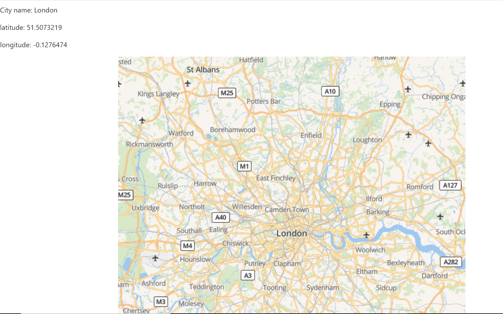

# white box testing for City Explorer web application 

## I will start on Back End:

* First check if we installed the packages or not:

As you can see in the image (1-1), axios packages, korean, dotnove, express packages are all installed in the latest update.

              
                      (1-1)

* The second thing we check if we have used all the packages we install:

                   
                      (1-2)

    As you can see in the image (1-2), pivot, dotnove, cors and express packages are implemented and used in the code.

* The third thing we check if the moviesHandler function will work:

                       (1-3)

                       (1-4)

     Here in pictures (1-4) we have movie processor job request and in the same pictures we can see the result of the request as you can see it working and give us reply with movie data we need

     About the function in pictures (1-3) and how it works, first thing the request sends and then enters the condition if the searchQuery data (city name) we received is not in the cache, the code will get that data from (https://api.themoviedb. org/3/search/movie?api_key=${API_Movies_KEY}&query=${searchQuery(city name)}) and save it to the cache and then send it as a response, but if the data is in the cache, the code will respond with the data in memory Caching to prevent requests from overloading 

* The fourth thing we check if WeatherHandler function will work:

                       (1-5)

                       (1-6)

     Here in the pictures (1-6) we have a request for the WeatherHandler function and in the same pictures the result of the request is as you can see it working and give us the response with the weather data we need

     About the function in pictures (1-5) works just like the moviesHandler function first thing you send, then you enter the condition if the searchQuery data (city name) we received is not in cache, the code will get that form data (https://api. weatherbit.io/v2.0/forecast/daily?city=${searchQuery(city name)} & key = ${API_Weather_KEY}) and save it inside the cache and then send it as a response, but if the data is in the cache, it will respond Code with the data in the cache to prevent requests from overloading

## Now I will start in Front End:

* First check if we installed the packages or not:

                       (2-1)

    As you can see in picture (2-1) the axios, bootstrap, response, response-bootstrap, response-dom packages are all installed in the last update.

* The second thing we check if we have used all the packages we install:

                       (2-2)

                       (2-3)

                       (2-4)

                       (2-5)

    As you can see in the pictures from (2-2) to (2-25) the axios and boot packages are imported and with each installed package

* Third thing we check if getLocFun function will work:

                       (2-6)

                       (2-7)

                       (2-8)

    Here in the picture (2-6) we have the location request function and in the pictures (2-7) the request result as you can see it working and giving us the response with the location data we need and giving it another function data (function getWeather and getMovies) which is obtained from our back end, and it will You send to the back end and then get a response from the api server we created

    About the function, it really works similar to the movie and weather functions, it sends a request to the locationIQ after that you will receive a response with the data we want after that we finish calling other functions (function getWeather and getMovies) in order to send a request to the server we created the data that reactivates it, then we finished You can view all results via the render function.

## Now the final result

                       (3-1)

                       (3-2)

                       (3-3)

                       (3-4)

    When we enter the name of the city in the assigned place and then click on (Explore!) button as you can see in the pictures (3-1), it will send the city name to the getLocFun function(2-6) and save it in search variable to send as searchQuery to our server and then it will render all function (WeatherDay and MoviesCard) (2-3)-(2-4).
    You can see the result in (3-2), (3-4) and (3-5).
